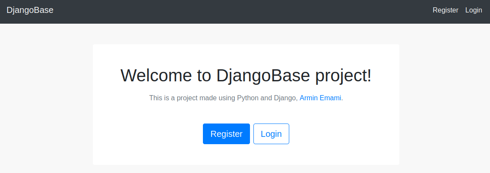
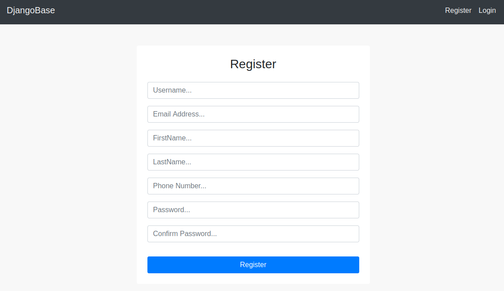
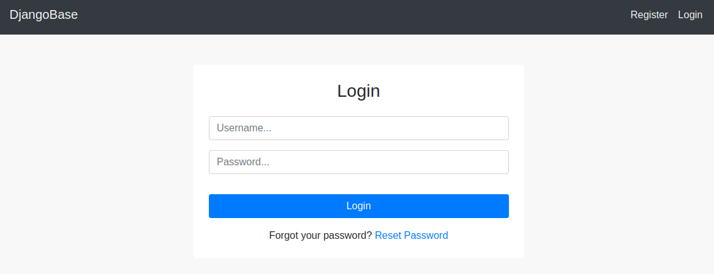
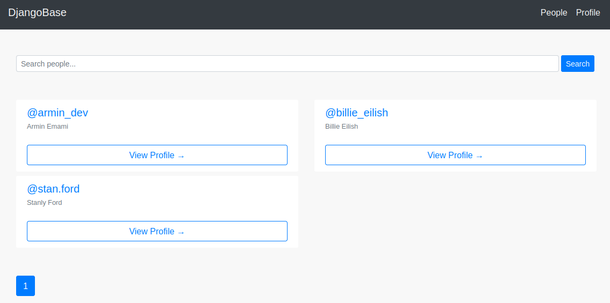
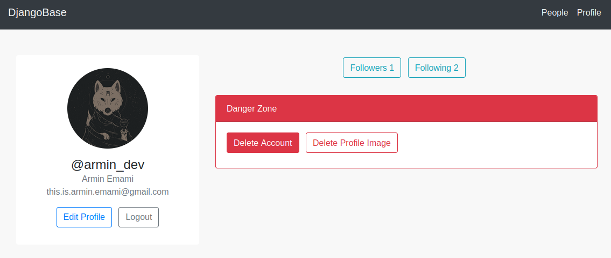
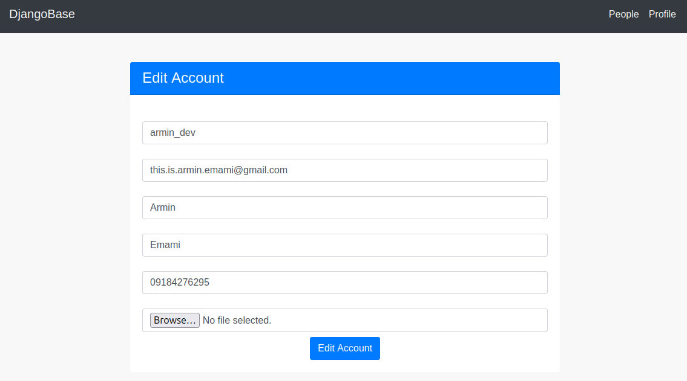

# Installing
### Run the following command:
    pip install -r requirements.txt

    python manage.py migrate
    
    python manage.py runserver

### Open browser and go to this address:

    localhost:8000

> نکته: برای اینکه توی بخش فراموشی رمز عبور بتونید SMS ارسال کنید، باید از یه سرویس ارسال sms استفاده کنید.   من اینجا از <a href='https://kavenegar.com/'>Kavenegar</a> استفاده کردم.   برای تغییرش برید توی این فایل: **utils/base.py**.

